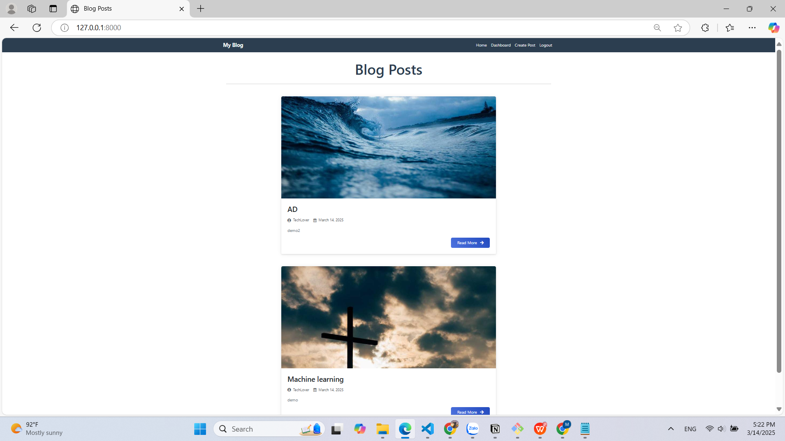
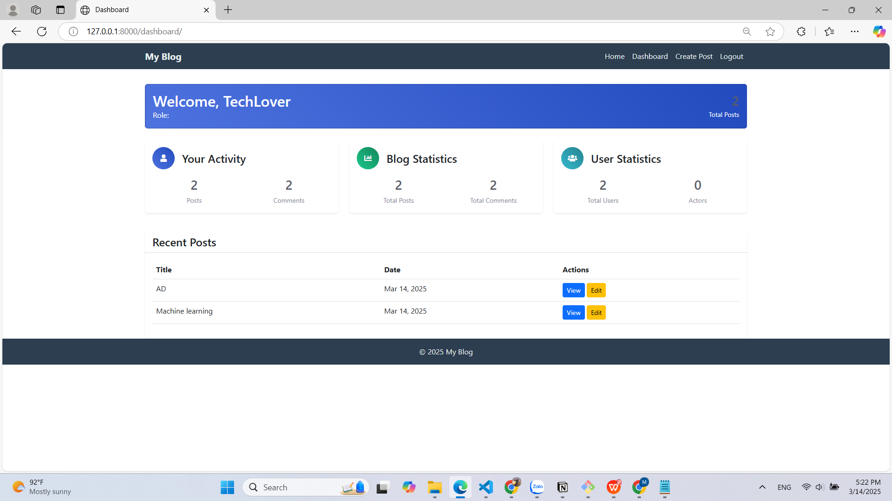

# Blog Project

## Thông tin cá nhân
- **Họ và tên:** Trương Long Tý
- **MSSV:** 22656001

## Giới thiệu
Đây là một project blog đơn giản được xây dựng bằng Django. Người dùng có thể đăng ký, đăng nhập, tạo bài viết, bình luận và quản lý các bài viết của mình.

## Chức năng chính
Ngoài những chức năng của một project blog thông thường, còn có:

- **Tạo layout: Single Column (Một Cột):** Giao diện của trang blog được thiết kế theo layout một cột, giúp người dùng dễ dàng theo dõi nội dung.

<div align="center">
    
</div>
<br>

- **Trang Dashboard:** Trang dashboard thể hiện thông tin tổng quan về trang blog, bao gồm số lượng bài viết, số lượng bình luận, và các bài viết gần đây.

<div align="center">
    
</div>

## Hướng dẫn cài đặt

### Yêu cầu hệ thống
- Python 3.x
- pip (Python package installer)

### Các bước cài đặt

1. **Clone repository:**
    ```sh
    git clone https://github.com/truonglongty/ptud-gk-de-1.git
    cd ptud-gk-de-1
    ```

2. **Chạy script cài đặt tự động:**
    ```sh
    chmod +x setup.sh
    ./setup.sh
    ```

### Chi tiết các bước cài đặt thủ công (nếu cần)

1. **Tạo và kích hoạt virtual environment:**
    ```sh
    python3 -m venv venv
    source venv/bin/activate  # Trên Windows: venv\Scripts\activate
    ```

2. **Cài đặt các gói yêu cầu:**
    ```sh
    pip install -r requirements.txt
    ```

3. **Thực hiện các migration:**
    ```sh
    python manage.py migrate
    ```

4. **Tạo superuser:**
    ```sh
    python manage.py createsuperuser
    ```

5. **Chạy server:**
    ```sh
    python manage.py runserver
    ```

6. **Truy cập ứng dụng:**
    Mở trình duyệt và truy cập `http://127.0.0.1:8000/`

## Sử dụng
- Đăng ký tài khoản mới hoặc đăng nhập bằng tài khoản admin đã tạo.
- Tạo bài viết mới, chỉnh sửa và xóa bài viết.
- Thêm bình luận vào các bài viết.